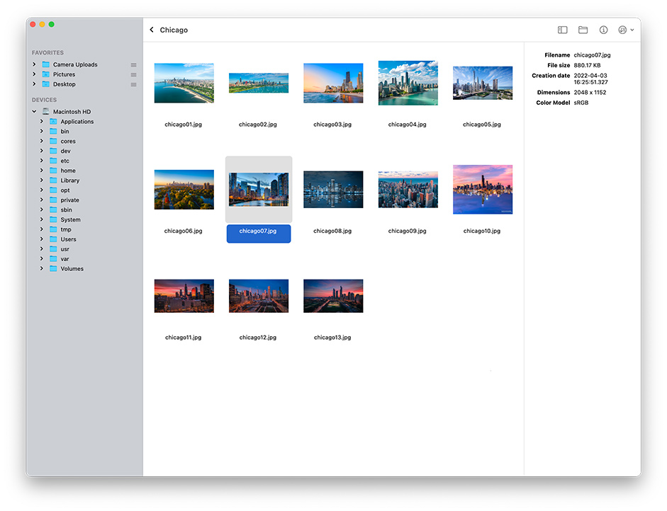

# foto

Image browser and viewer written in Flutter.

Currently only developed and tested for MacOS.




## Instructions

```
flutter pub get
flutter run -d macos
```

To build in Release mode and install in your Applications folder:

```
make deploy
```

## TODO

- [x] Favorites ordering
- [ ] ~~Get folder icons from NSWorkspace~~ (too slow)
- [x] Photo viewer with zoom
- [ ] Exif cache database
- [ ] Black background
- [x] Selection info palette
- File operations:
  - [x] delete
  - [x] clipboard
  - [x] rename
  - [x] move
- Folder operations
  - [x] delete
  - [x] clipboard
  - [ ] rename
  - [x] move
- Image manipulations
  - [x] rotations
  - [ ] resize
  - [ ] convert
- [ ] Set as wallpaper
