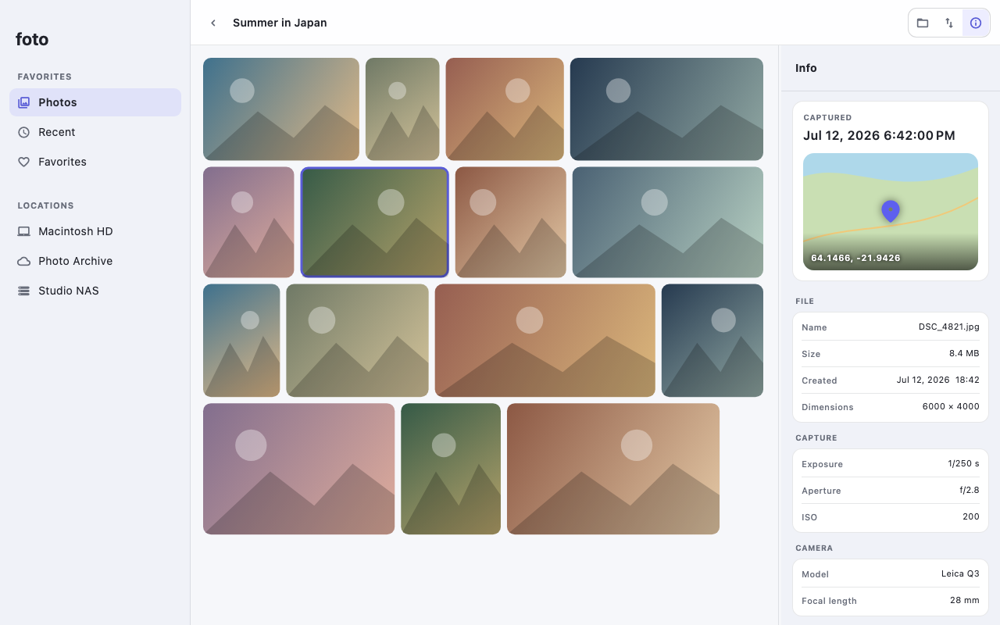

# foto

A fast, focused photo browser for macOS, built with Flutter.

<picture>
  <source media="(prefers-color-scheme: dark)" srcset="test/goldens/foto-dark.png">
  <source media="(prefers-color-scheme: light)" srcset="test/goldens/foto-light.png">
  
</picture>

## Highlights

- Dynamic justified gallery with lazy rendering for large photo collections
- Fast navigation through favorites, local disks, and network locations
- Capture-focused inspector with date, GPS location, and native MapKit snapshot
- Detailed file, exposure, camera, and image metadata
- Full-screen photo viewer with zoom, rotation, and clipboard actions
- Instant 100% loupe while holding Space over a gallery photo
- Folder-scoped visual similarity review powered by native macOS Vision
- Synchronized side-by-side comparison for two to four photos
- File copy, move, rename, and delete plus folder copy, move, and delete
- Custom light and dark appearances that follow the macOS system setting

foto is currently developed and tested for macOS.

## Run locally

Install [Flutter](https://docs.flutter.dev/get-started/install/macos), then run:

```sh
flutter pub get
flutter run -d macos
```

## Build and install

Build foto in release mode and install it in `/Applications`:

```sh
make deploy
```

## Verify changes

```sh
flutter analyze
flutter test
flutter build macos --debug
```

## Roadmap

- EXIF metadata cache
- Folder rename
- Image resize and format conversion
- Set an image as the desktop wallpaper
